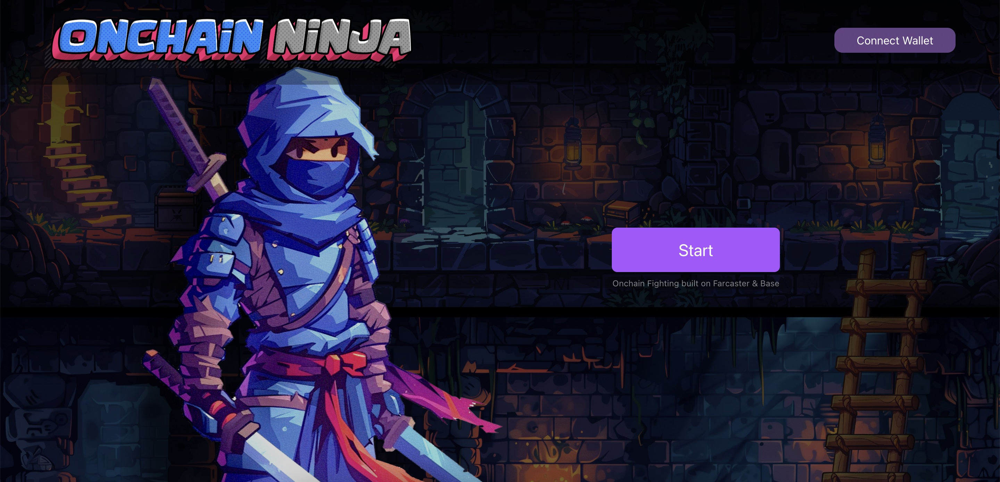
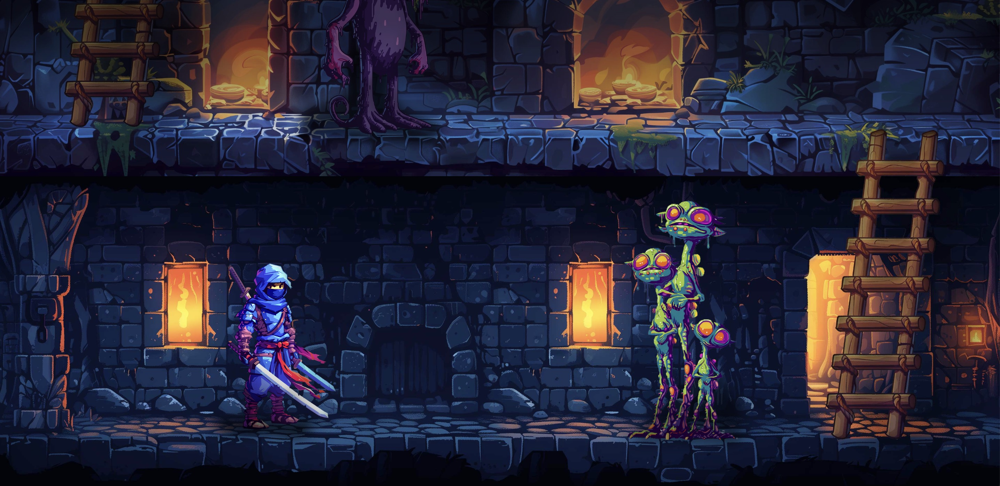
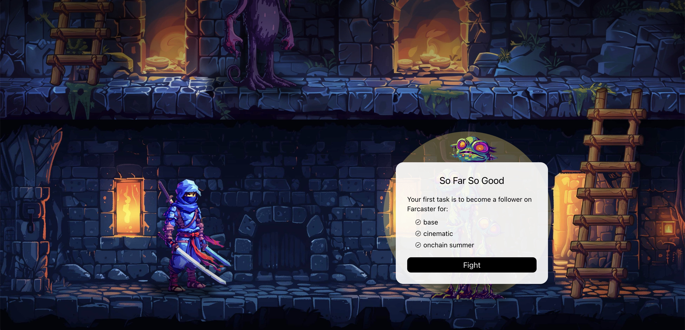

# 🕹️ Onchain Quest — Game x Social dApp  
### 🎮 Hackathon Project — Base Onchain Summer 2024 (Category: Gaming & Social)

## 🧩 Overview

**Onchain Quest** is an interactive, gamified social experience built entirely onchain on the **Base** network. The project was created during the **Base Onchain Summer 2024 Hackathon**, in the **Gaming & Social** category.

The application combines **onchain identity, NFT progression, and wallet interactions** in a multi-level quest where users verify steps by interacting with smart contracts, switching networks, and connecting social identities such as Farcaster.

Each level represents a deeper integration into the onchain ecosystem — turning learning and onboarding into a fun and rewarding game.

---

## 🚀 Features

- ✅ **5-level gamified onboarding experience**
- 🧠 **Social identity verification** using Farcaster
- 🖼️ **NFT progression system** (smart contract-based levels)
- 🔐 **Wallet-connected experience** (via AppKit)
- 🎯 **Fully onchain logic**, with front-end checks and EVM read interactions
- 🎨 **Custom UI components** (React + Tailwind, styled with modularity)

---

## 📸 Screenshots

| Level Start | Onchain Task |
|------------|---------------|
|  | 

---

## 🛠️ Stack

- **React** + **Next.js 14**
- **ethers.js**
- **Base L2**
- **AppKit SDK**
- **Farcaster API (Neynar)**
- **Smart Contract interaction**
- **TailwindCSS**

---

## 🏆 Hackathon Info

- 🗓️ **Event:** Base Onchain Summer 2024  
- 🧑‍💻 **Track:** Games & Social  
- ⏱️ **Duration:** 2 days  
- 👥 **Solo project**
- 🌐 Website: [onchain-ninja.vercel.app](https://onchain-ninja.vercel.app/)

---

> 💡 *The code for this project is not open source, but images and this documentation serve as a showcase for functionality and design.*
